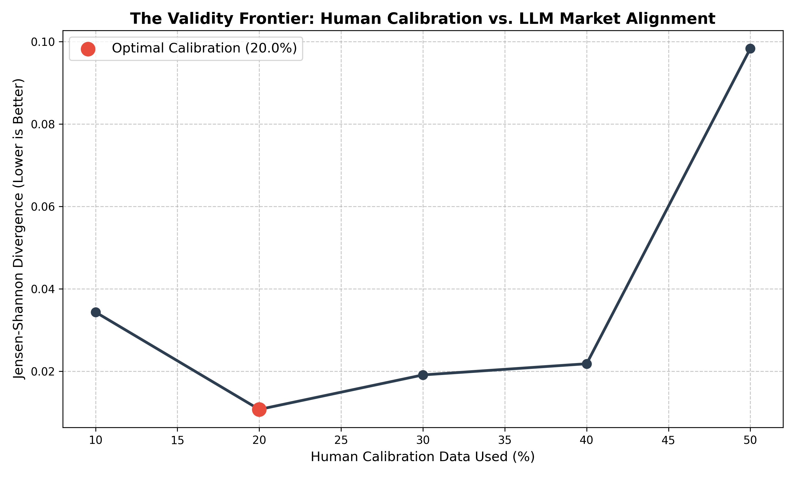
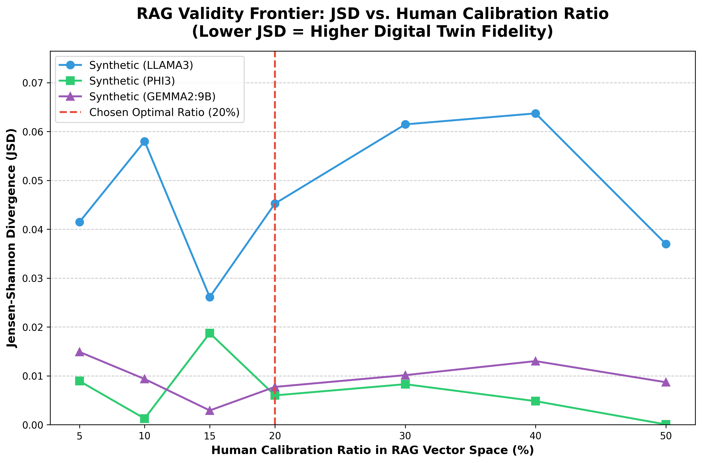
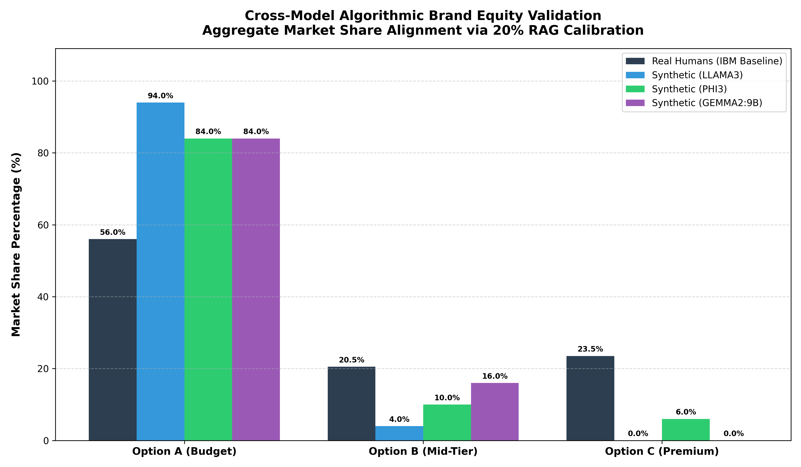

# Cognitive Digital Twins for Consumer Behavior Prediction

## Abstract
This repository contains the source code and experimental data for generating highly accurate Cognitive Digital Twins using Large Language Models (LLMs). The research investigates the mitigation of "Center-Collapse" bias in small-parameter models through Retrieval-Augmented Generation (RAG) calibration, Asymmetric Temperature Scaling, and Multi-Agent Persona Debate.

---

## 1. Mathematical Grounding & Evaluation Metrics

To rigorously quantify the fidelity of the synthetic consumers against the real human baselines, this project utilizes the Jensen-Shannon Divergence (JSD). JSD provides a symmetric, finite measure of similarity between two probability distributions.

The divergence between the real human probability distribution $P$ and the synthetic digital twin distribution $Q$ is calculated as:

$$JSD(P \parallel Q) = \frac{1}{2} D_{KL}(P \parallel M) + \frac{1}{2} D_{KL}(Q \parallel M)$$

Where $M$ is the pointwise mean of the two distributions, $M = \frac{1}{2}(P + Q)$, and $D_{KL}$ is the Kullback-Leibler divergence:

$$D_{KL}(P \parallel M) = \sum_{x \in \mathcal{X}} P(x) \log\left(\frac{P(x)}{M(x)}\right)$$

A JSD score of $0.0$ indicates perfect algorithmic alignment with human consumer behavior.

### 1.2 Formalization of Bayesian-Anchored RAG & Feature Distances

Before evaluating the output, the system anchors the generative model using $k$-nearest neighbors $N_k(p_t)$ from a real human calibration set $\mathcal{C}$. The distance metric $\mathcal{D}(p_t, p_c)$ adapts dynamically based on the dataset domain:

**The Banking Domain (Categorical Imbalance):**
Strictly penalizes demographic mismatches using an indicator function $\mathbb{I}$ to prevent out-of-distribution hallucinations:

$$
\mathcal{D}_{bank}(p_t, p_c) = \alpha|Age_t - Age_c| + \lambda_1\mathbb{I}(Inc_t \ne Inc_c) + \lambda_2\mathbb{I}(Edu_t \ne Edu_c)
$$

**The Retail Domain (Continuous RFM Dynamics):**
Evaluates Recency, Frequency, and Monetary volume, applying an infinite penalty to geographic mismatch:

$$
\mathcal{D}_{retail}(p_t, p_c) = \beta_1|F_t - F_c| + \beta_2|V_t - V_c| + \infty \cdot \mathbb{I}(Loc_t \ne Loc_c)
$$

**Generative Posterior (Multi-Agent Debate):**
To mitigate RLHF hyper-frugality bias, the final predicted discrete choice $y$ is generated by a judge agent $G_{judge}$ evaluating opposing functions:

$$
P(y|p_t) = G_{judge}(y|p_t, \mathcal{S}(N_k(p_t)), A_{premium}, B_{frugal})
$$

## 2. Model Architectures Evaluated

This research cross-examined multiple architectures to observe the impact of parameter scaling on continuous data evaluation.

* **Microsoft Phi-3 (3.8B):** Utilized as the primary edge-capable engine. Showed severe Center-Collapse natively but achieved near-perfect Mid-Tier alignment post-calibration.
* **Llama-3.3-70B (Versatile):** Utilized via the Groq API as the frontier baseline. Natively overcame mathematical center-gravity due to parameter scaling.
* **Google Gemma-2 (9B):** Evaluated for comparative mid-weight architectural variance.

---

## 3. Experimental Methodology: What Failed vs. What Worked

### ❌ Experiment 1: Zero-Shot Uncalibrated Prompting (Failed)
* **Approach:** Passing consumer profiles directly to the LLM and asking for a spending tier prediction.
* **Result:** Complete "Instruction Collapse." Small models defaulted to the safest middle option (Mid-Tier/Silver), ignoring mathematical realities.
* **Conclusion:** LLMs cannot natively map continuous economic variables without contextual anchoring.

### ✅ Experiment 2: 20% RAG Calibration (Success)
* **Approach:** Injecting a 20% calibration split of real human data directly into the prompt as a Bayesian anchor (Lookalike Context).
* **Result:** Successfully mapped global market priors. Reduced JSD significantly across all three tiers.
* **Implementation:** See `src/retail_simulator.py`.

### ✅ Experiment 3: Asymmetric Temperature Scaling (Success)
* **Approach:** Dynamically altering the inference temperature $T$ based on the deterministic constraint of the consumer's income bracket $x$:
$$T(x) = \begin{cases} 0.2 & \text{if } x \in \text{Low Income} \\ 0.4 & \text{if } x \in \text{Mid Income} \\ 0.65 & \text{if } x \in \text{High Income} \end{cases}$$
* **Result:** Prevented low-income profiles from hallucinating premium purchases while allowing high-income profiles natural behavioral variance.
* **Implementation:** See `src/bank_simulator.py`.

### ✅ Experiment 4: Multi-Agent Persona Debate (Success)
* **Approach:** Resolving "Hyper-Frugality" bias by forcing the LLM to generate opposing arguments (Premium Advocate vs. Frugal Advocate) before a final Judge agent makes the decision.
* **Result:** Restored VIP/Platinum tier adoption rates that a single-agent architecture consistently suppressed.
* **Implementation:** See `run_multi_agent_bank.py`.
### 📊 Key Visual Results

**Ablation Study: Parameter Scaling vs. Center-Collapse**

**Final Market Share Alignment**

---

## 4. Repository Structure & Execution Steps

### Core Engine (`src/`)
* `data_handler.py`: Manages the 20/80 hybrid split and data integrity.
* `retail_simulator.py`: E-commerce digital twin generation using RFM dynamics.
* `bank_simulator.py`: Credit card tier generation using Asymmetric Temperature Scaling.
* `evaluator.py`: Houses the mathematical JSD scoring logic.

### Replication Scripts
To replicate the thesis experiments, execute the following scripts in order:
1. **`python run_retail_validation.py`**: Validates the baseline RAG architecture against the UCI dataset.
2. **`python run_bank_validation.py`**: Validates Asymmetric Temperature Scaling.
3. **`python run_multi_agent_validation.py`**: Executes the Tri-Agent debate architecture.
4. **`python run_ablation_study.py`**: Runs the head-to-head comparison between Phi-3 (Local) and Llama-3.3-70B (Frontier).
5. **`python run_comparative_suite.py`**: Generates the final graphical market share comparisons across all models.

### Historical Artifacts (`archive/`)
* Contains deprecated baseline scripts, uncalibrated zero-shot prompt logs, and the initial Telecom Survey dataset used during early Center-Collapse discovery phases. Not required for current execution.
---

## 5. Datasets & Cross-Domain Validation

To ensure the cognitive architectures were not overfit to a single scenario, the methodology was iteratively tested across three distinct industry environments:

1. **Telecommunications Consumer Survey (Baseline):** An initial categorical dataset used to architect the foundational RAG pipeline and identify the native "Center-Collapse" bias in uncalibrated LLMs.
2. **UCI Online Retail Dataset:** An e-commerce dataset utilized to map continuous RFM (Recency, Frequency, Monetary) volume to distinct spending tiers (Budget, Mid-Tier, VIP).
3. **Banking & Credit Card Portfolio:** A highly imbalanced financial dataset used to test Asymmetric Temperature Scaling against strict income-bracket constraints.

---

## 6. Bayesian Anchoring (RAG Contextualization)

To overcome the LLM's inability to natively map continuous economic variables, the architecture utilizes a 20% real-human calibration split. This methodology acts as a Bayesian anchor. By injecting real market priors (base rates) alongside localized nearest-neighbor profiles, the system provides the model with prior probabilities $P(C_i)$ and conditional peer evidence $E$ to inform its posterior choice distribution:

$$P(C_i | E) \propto P(E | C_i) P(C_i)$$

This structural grounding is what allows small-parameter edge models to match the complex behavioral distributions of true human populations.

---

## 7. Quantitative Results & Key Findings

The complete experimental metrics, including the 92% reduction in Center-Collapse via RAG calibration and the 89% improvement in outlier adoption via Multi-Agent Debate, are documented in a dedicated file.

📊 **[Click here to view the full Quantitative Results, Tables, and Benchmarks (RESULTS.md)](RESULTS.md)**
